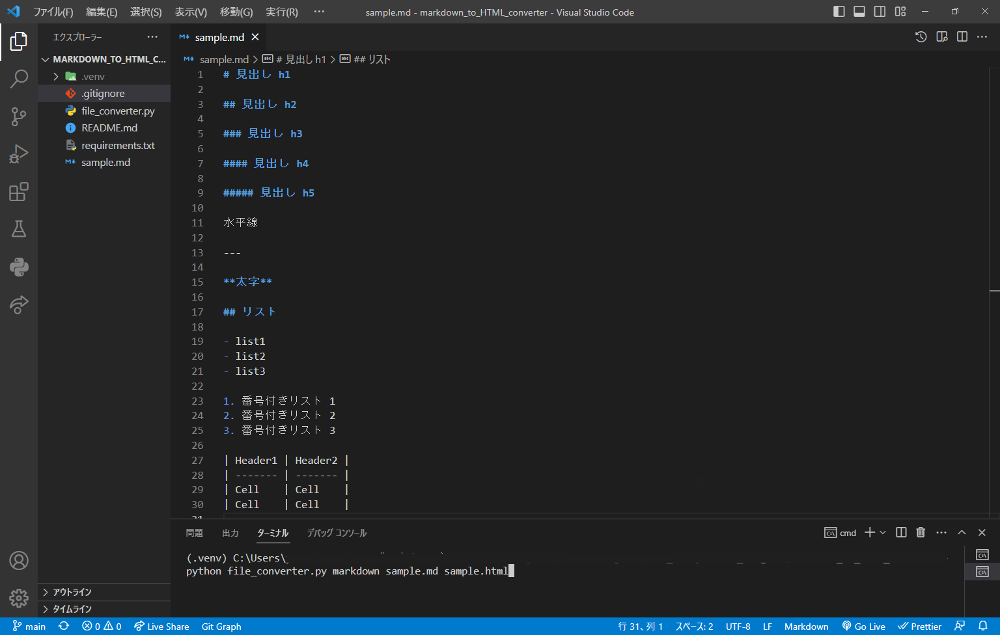
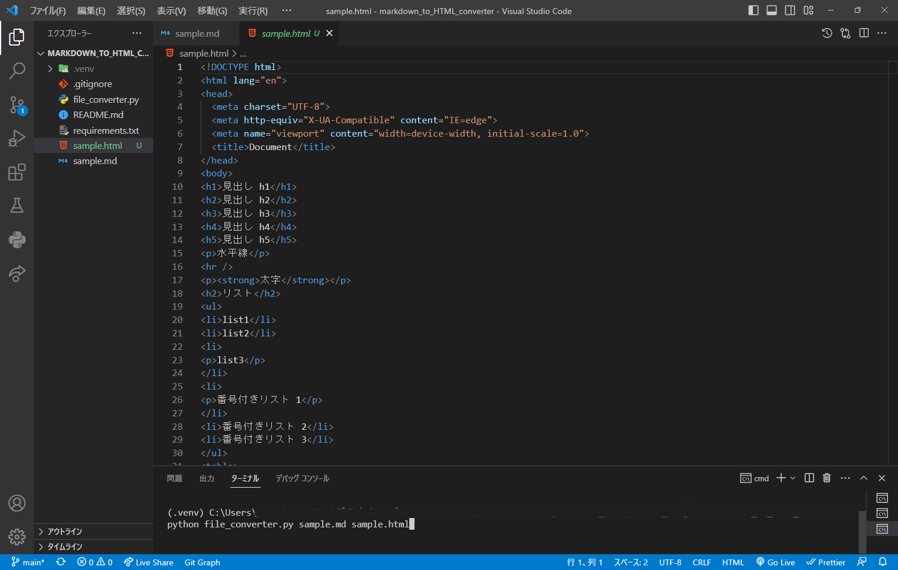
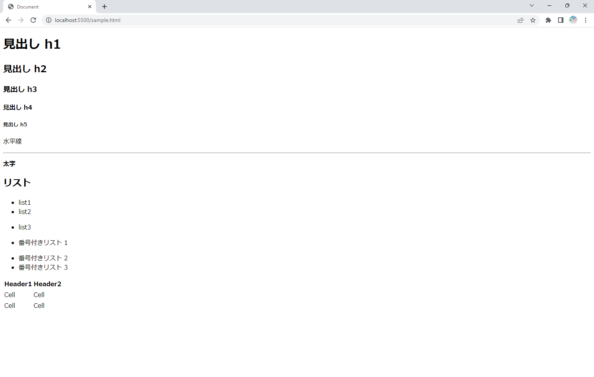

# Markdown to HTML Converter

## 概要

<p>
  マークダウンを HTML に変換する Python スクリプトです。
  <br>
  python-markdown ライブラリーを使用してマークダウンの文字列を HTML の文字列に変換します。
  <br>
  引数の数及び入力が正しいかどうかをチェックするバリデータを記述しており、不適切な入力がされた場合、エラー内容と使用方法を出力してシステムを終了します。
  <br>
  また、指定したHTMLファイルが既に存在している場合は、上書きされます。
</p>

**変換前**


**変換後**


**ブラウザー**


**エラー処理**

```
>python file_converter.py markdown
Error!!
エラー: 不適切な引数の数です。正しい引数の数は4です。
使用法: python file_converter.py markdown sample.md sample.html

>python file_converter.py Markdown sample.md sample.html
Error!!
エラー：コマンド Markdown は存在しません。使用できるコマンドはmarkdownです。
使用法: python file_converter.py markdown sample.md sample.html

>python file_converter.py markdown sample1.md sample.html
Error!!
エラー：ファイル sample1.md は存在しません。正しいファイルパスを指定してください。
使用法: python file_converter.py markdown sample.md sample.html

>python file_converter.py markdown dummy.html sample.html
Error!!
エラー：ファイルパス dummy.html の拡張子が適切ではありません。使用できる拡張子は.mdです。
使用法: python file_converter.py markdown sample.md sample.html
```

## 作成目的

- Python でデータストリームを理解する。
- シェルから引数を取得する方法（コマンドライン引数）を理解する。
- ファイルシステムを操作したファイルの読み書き。

## 実行環境

- Windows 11 64bit
- Python 3.10.7
- Windows コマンドプロンプト(cmd.exe)

## セットアップ

### 仮想化

```shell
python -m venv .venv
```

```shell
.venv\Scripts\activate.bat
```

### pip install

```shell
pip install -r requirements.txt
```

## 使用方法

```shell
python file_converter.py markdown inputfile outputfile
```

- markdown 実行するコマンド(現在は markdown のみ)
- inputfile .md ファイルへのパス
- outputfile プログラムを実行した後に作成される.html ファイルのパス

具体的な使用例

```shell
python file_converter.py markdown sample.md sample.html
```
